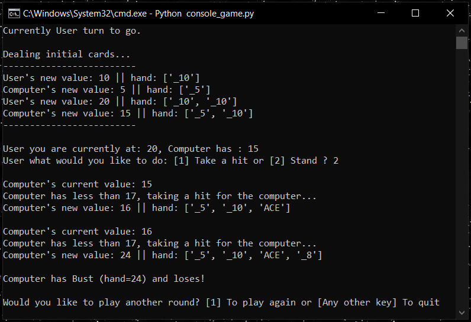

# Blackjack Console App

This folder contains source code for a Python based CLI implmentation of the game Blackjack.

## Game Modes
# 2-Player Mode
In this mode, two players take turns making their selection to either hit or stand. The player to bust first loses. To win, a player must reach Blackjack (hand value = 21) or if both players have decided to stand the player with the higher hand value wins.

# Vs-Computer Mode
In the Vs-Computer mode, one user competes against the computer. On each turn of the computer, it will take a hit until it's hand value reaches 17 or higher. Upon reaching 17 or higher the computer will stand.
				
## Python Blackjack Console App:

## Python Project Structure

        │
        ├── console_game.py                        	# Main entry point for the application
        ├── game_classes                    		# Folder containing the game classes and enums
                ├── card_class.py                  	
                ├── card_suit_enum.py                   
                ├── card_type_enum.py                  	
                ├── deck_class.py                       
                ├── game_controller_class.py            
                ├── game_main_class.py                  
                ├── game_state_manager_class.py         
                ├── helper_functions.py                 
                ├── player_class.py                  	
                ├── player_status_enum.py               
        ├── images                		        # Folder for images
               └── python-console-app.png            	# Demo output image used on github repo

## Tech Used
- Python 3.11.5